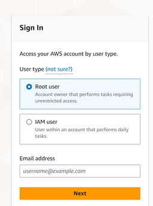
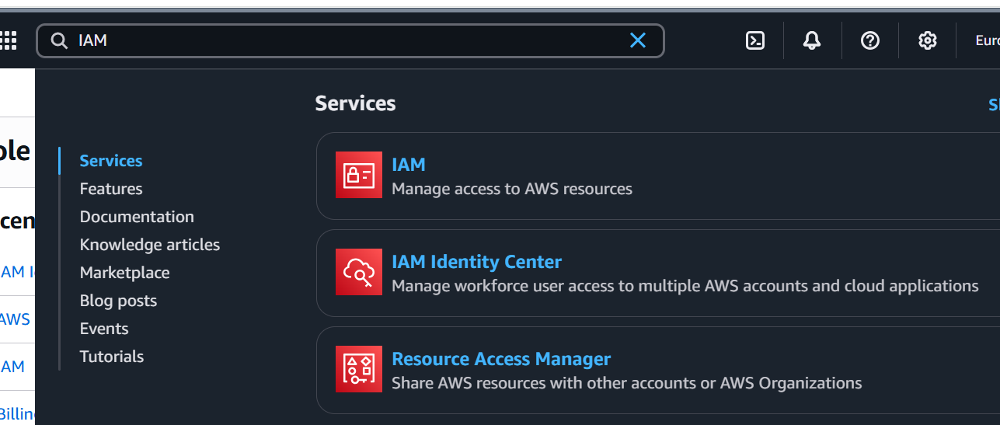
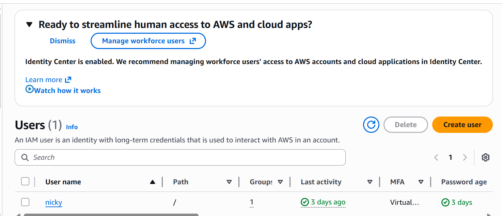
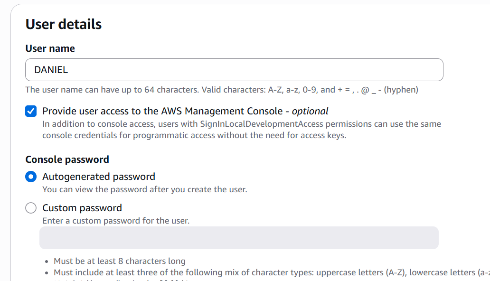
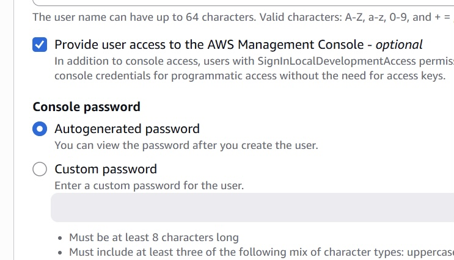
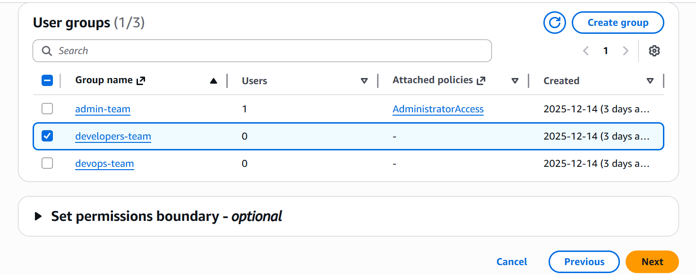
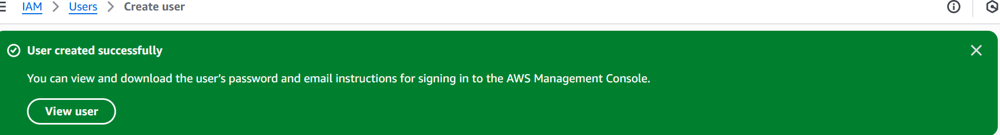
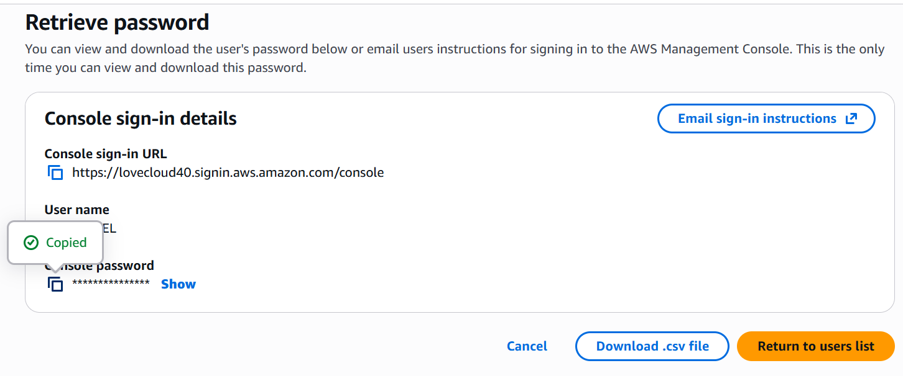

# AWS-Organization-and-IAM-Setup
Hands-on AWS security project covering multi-account management, IAM configuration, and access control.

## Table of Contents

- [Project Overview](#project-overview)
- [Technologies Used](#technologies-used)
- [AWS IAM (Identity and Access Management)](#aws-identity-and-access-management-iam)
- [Creating an IAM User in AWS](#creating-an-iam-user-in-aws)
- [Project Architecture](#project-architecture)
- [Security Best Practices](#security-best-practices)
- [Lessons Learned](#lessons-learned)
- [Conclusion](#conclusion)

## Project Overview

This project demonstrates how to set up an AWS Organization for a company managing three AWS accounts and implement secure access control using AWS Identity and Access Management (IAM).

The project focuses on creating IAM users, grouping them based on roles, and assigning appropriate permissions using IAM policies. It also highlights cloud security best practices such as role-based access control and the principle of least privilege.

---
### Architecture Diagram

Management Account (Root)  
│  
├── Development Account  
├── Production Account  
└── Security Account  

IAM Users → IAM Groups → IAM Policies → AWS Resources

## Project Objectives

- Set up an AWS Organization
- Manage three AWS accounts under a centralized management account
- Create IAM users
- Group users based on roles
- Assign permissions using IAM policies
- Implement secure access control practices

---

## Technologies Used

- AWS Organizations
- AWS Identity and Access Management (IAM)
- AWS Management Console
- Cloud Security Best Practices

  ---
  
## AWS IAM (Identity and Access Management)

AWS Identity and Access Management (IAM) is a service that allows you to create and manage identities and control access to AWS resources.

IAM users are created inside an AWS root account, but they do not use the same email address or login method as the root account. Instead, IAM users sign in through the IAM sign-in page (IAM login center) using a unique username and password assigned by the administrator.

IAM is a core service within an AWS account and can also be used across AWS Organizations, where it is centrally managed by the main (management) AWS account.

### How IAM Works:

Think of the AWS root account as the CEO of a company

- The root account (CEO) owns the company and has full control  
- IAM (management system) creates and manages workers  
- IAM users, roles, and groups are the workers  
- Each worker is assigned a role and given specific permissions based on their job  
- All workers operate under the authority of the root account  

If the root account is compromised or deleted, all IAM users, roles, and permissions under that account are affected—just like a company shutting down would cause all employees to lose their jobs.

### In short form:

IAM is the system that lets the AWS root account safely give people limited access to cloud resources.

## Creating an IAM User in AWS

### Step 1: Sign in to AWS
1. Go to https://aws.amazon.com  
2. Click **Sign in to the Console**  
3. Select **Root user**  
4. Enter your **email and password**

---

### Step 2: Navigate to IAM
1. On the AWS Console, locate the **search bar**
2. Type **IAM**
3. Click **Identity and Access Management (IAM)**

---

### Step 3: Open IAM Users Dashboard
1. On the IAM dashboard, click **Users**

---

### Step 4: Create a New User
1. Click **Create user**
2. Enter a **User name**

Example:
- `admin-user`
- `love-iam-user`

---

### Step 5: Configure Console Access
1. Under **AWS Management Console access**, select  
   **Provide user access to the AWS Management Console**
2. Choose **I want to create an IAM user**
3. Set password:
   - Auto-generated password  
   - Or Custom password
4. (Optional) Check **User must create a new password at next sign-in**
5. Click **Next**

---

### Step 6: Assign Permissions / User Group
1. Select **Attach policies directly** or add user to a **Group**
2. Example group: `developers-team`
3. Click **Next**

---

### Step 7: Review and Create User
1. Review:
   - Username
   - Permissions
2. Click **Create user**

---

### Step 8: Retrieve Login Credentials
Download the **.csv file** or copy:

- Console sign-in URL
- Username
- Password

---

### Step 9: IAM User Login
Open the IAM login URL and sign in using the new credentials.

## Project Architecture

The project architecture is based on a centralized cloud management model using AWS Organizations and IAM.

- A **Management Account (Root Account)** controls the AWS Organization  
- Three AWS accounts are managed under the organization:
  - Development Account
  - Production Account
  - Security/Shared Services Account
- IAM is used to create users and groups
- Permissions are assigned using IAM Policies
- Role-Based Access Control (RBAC) is implemented to manage access securely

This architecture allows centralized governance, billing management, and secure access control across multiple AWS accounts.

---

## Security Best Practices

The following security practices were implemented during this project:

- Avoid using the **Root Account** for daily administrative tasks  
- Enable **Multi-Factor Authentication (MFA)** on the Root Account  
- Apply the **Principle of Least Privilege** when assigning permissions  
- Use **IAM Groups** to manage permissions instead of assigning policies directly to users  
- Regularly rotate passwords and access credentials  
- Monitor user activity using AWS logging and monitoring services  

These practices help improve overall cloud security and reduce the risk of unauthorized access.

---

## Lessons Learned

During this project, the following key lessons were learned:

- AWS Organizations helps simplify management of multiple AWS accounts  
- IAM provides secure and flexible access control mechanisms  
- Group-based permission management is more scalable than user-based permissions  
- Security best practices such as MFA and least privilege are critical in cloud environments  
- Proper documentation improves project clarity and professional presentation  

---

## Conclusion

This project successfully demonstrated how to set up an AWS Organization and implement Identity and Access Management (IAM) for secure user administration.

By creating IAM users, grouping them based on roles, and assigning appropriate permissions, the organization can securely manage access to cloud resources.

This hands-on implementation strengthens practical knowledge of cloud security, governance, and identity management in AWS environments.

 ## Author

Love Daniel  
Cloud Engineering | Cloud Security | DevOps

linkedin profile: http://linkedin.com/in/daniel-love-558586345

Email:lovedaniels2239@gmail.com

